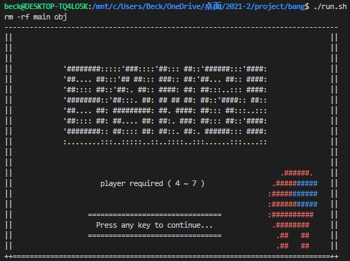
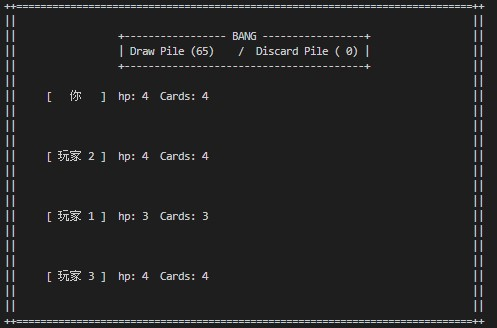
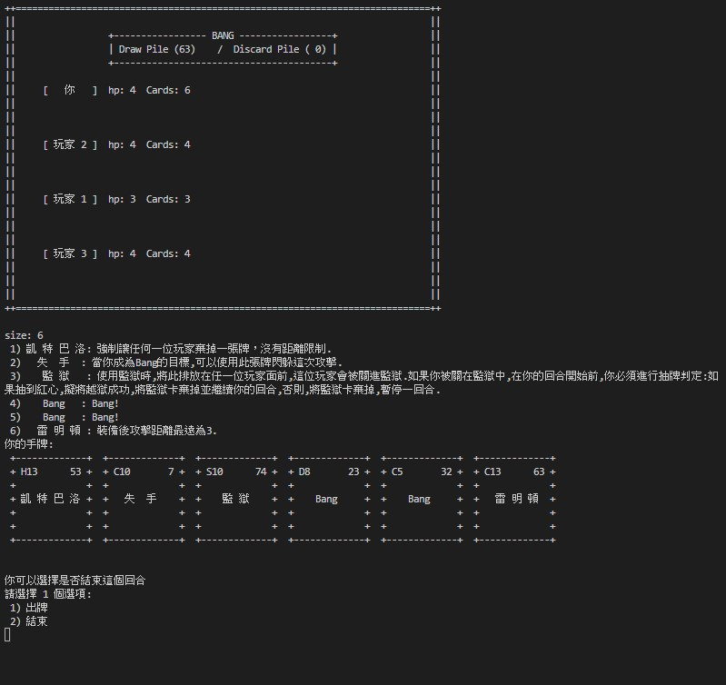
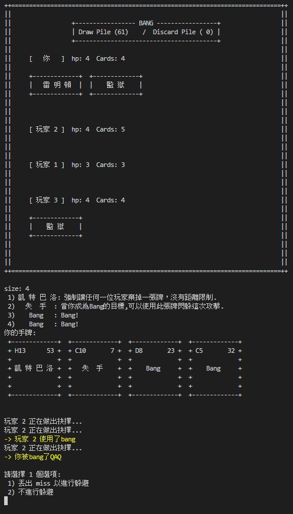
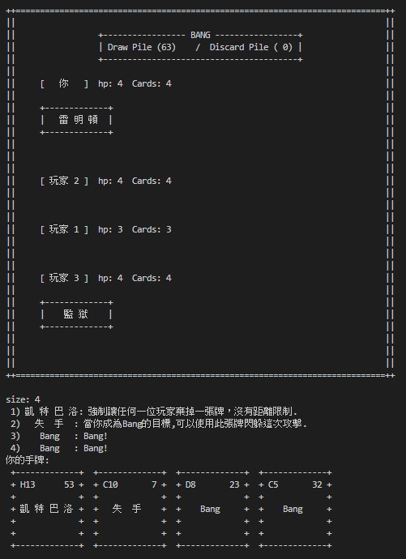
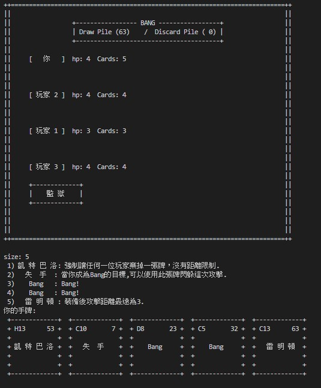
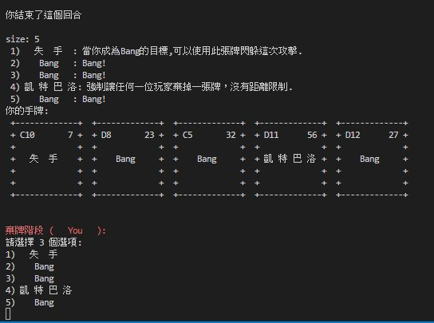
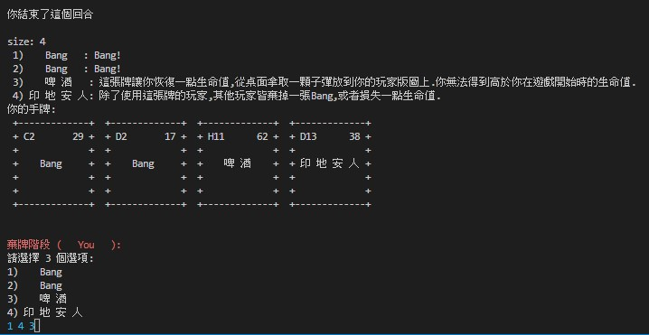
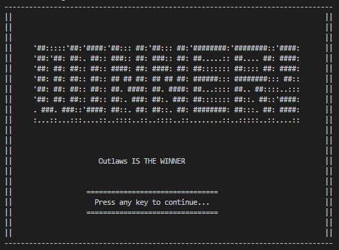
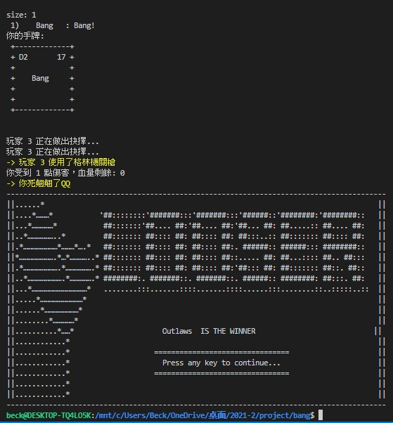

# Bang

## How to play

### Using Local Terminal
1. Go to WSL (or anywhere else that can run Makefile)
2. Check for MakeFile
3. Install Make (If do, than skip)
```shell
$ sudo apt-get update
$ sudo apt install make
```
4. use commend `./run.sh`

### Use <a href="https://github.com/codespaces">Online code space</a>

## Game Images




## card effects






## end game


